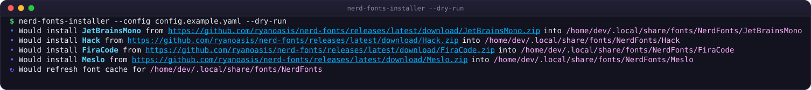
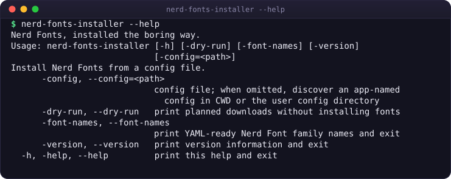

<div align="center">


# nerd-fonts-installer-scala

### Install Nerd Fonts from one config file — a single native binary, no JVM required.

[](https://github.com/worxbend/nerd-fonts-installer-scala/releases)
[](https://github.com/worxbend/nerd-fonts-installer-scala/actions/workflows/checks.yml)
[](LICENSE)
[](https://scala-lang.org)
[](https://www.graalvm.org/latest/reference-manual/native-image/)
[](#quick-start)

[Quick start](#quick-start) &nbsp;•&nbsp;
[Configuration](#configuration) &nbsp;•&nbsp;
[Command reference](#command-reference) &nbsp;•&nbsp;
[Troubleshooting](#troubleshooting) &nbsp;•&nbsp;
[Security](#security-in-brief)



</div>

---

## Why

Installing a Nerd Font by hand is the same eight steps every time: find the release page, pick the right
archive, download it, unzip it, fish out only the font files, move them into a font directory, refresh the
font cache — then do it again for every family, on every machine.

<table>
<tr><th align="left">😩 By hand, every time</th><th align="left">✨ With this</th></tr>
<tr valign="top"><td>

1. Open the Nerd Fonts release page
2. Find the right archive
3. Download it, unzip it
4. Fish out only the font files
5. Move them to a font directory
6. Refresh the font cache
7. **Repeat per family, per machine**

</td><td>

```bash
nerd-fonts-installer --dry-run
nerd-fonts-installer
```

…driven by four lines of YAML you keep in
your dotfiles. **That's it.**

</td></tr>
</table>

Reach for it when you provision dev containers, rebuild laptops, or just want the same glyphs in Starship,
Neovim, tmux, WezTerm or Alacritty on every machine you touch — without a JVM runtime to run it.

This is a self-contained Scala 3 CLI that installs Nerd Fonts from a declarative config and ships as a
GraalVM native binary instead of a JVM jar. It runs as one executable: no package manager, no runtime JVM,
and no extra tooling required.

## Quick start

### 1. Install the binary

```bash
curl --proto '=https' --tlsv1.2 -sSfL \
  https://github.com/worxbend/nerd-fonts-installer-scala/releases/download/latest/install.sh | sh
```

`scripts/install.sh` detects `{linux,macos}-{amd64,arm64}`, downloads the matching tarball and
`checksums.txt` from the same GitHub release, verifies the SHA-256, and installs into `~/.local/bin` — no
root, no package manager. Set `NERD_FONTS_INSTALLER_VERSION=v1.0.0` before the pipe to pin an exact tag, or
`NERD_FONTS_INSTALLER_INSTALL_DIR` to change where the binary lands.

<details>
<summary>Build from source instead (what CI does)</summary>

<br>

Nothing to install beyond `git` and the repo's `./mill` wrapper — it fetches Mill, and Mill fetches GraalVM
Community for JDK 25 as the build's own toolchain. No system JDK, no `GRAALVM_HOME`.

```bash
git clone https://github.com/worxbend/nerd-fonts-installer-scala
cd nerd-fonts-installer-scala
./mill --no-daemon show app.nativeImage
# → a path ending in out/app/nativeImage.dest/native-executable

out/app/nativeImage.dest/native-executable --version
```

Just want to try it without waiting for `native-image` to link? Run it on the JVM straight from source
(arguments belong directly after `app.run` — this repo's `./mill` wrapper drops everything after a bare `--`,
so don't use one):

```bash
./mill --no-daemon app.run --version
./mill --no-daemon app.run --config config.example.yaml --dry-run
```

</details>

### 2. Write a config

```yaml
# ~/.config/nerd-fonts-installer/config.yaml
release: latest
destination: ~/.local/share/fonts/NerdFonts
refresh_font_cache: true
families:
  - JetBrainsMono
  - Hack
  - FiraCode
  - Meslo
```

(`config.example.yaml` in the repo root is exactly this, plus comments — copy it.) Not sure what a family
is called? Ask the tool — it prints paste-ready names for whichever release you're pinned to:

```bash
nerd-fonts-installer --font-names
```

### 3. Preview, then install

```bash
nerd-fonts-installer --dry-run   # shows every URL and destination, touches nothing
nerd-fonts-installer             # downloads, verifies, extracts, installs
```

Four families install concurrently, each verified against the release's `SHA-256.txt` before it touches
disk. Then select the patched font — e.g. **JetBrainsMono Nerd Font**, not `JetBrainsMono` — in your
terminal or editor preferences and restart it.

---

## Configuration

Format is picked by the file's extension: `.json` decodes as JSON, `.yaml`/`.yml` as YAML, and
`.conf`/`.hocon` as [HOCON](https://github.com/lightbend/config/blob/main/HOCON.md). JSON is parsed
leniently (through Typesafe Config, so comments and unquoted keys are accepted). An **unknown or missing
extension is now a hard error** (exit `1`) — the loader no longer silently guesses YAML, which used to hide a
typo like `config.yam`.

> [!IMPORTANT]
> **`.conf` is now HOCON, not YAML** — a breaking change if you kept a YAML file with a `.conf` name. A flat
> `key: value` file parses the same either way, but a YAML block sequence (`- JetBrainsMono`) is **not** valid
> HOCON: rewrite it as `families = ["JetBrainsMono"]`, or rename the file to `.yaml`.

Decoding is **lenient**, not strict: an **unknown key is ignored** rather than rejected, and a scalar where a
list is expected is coerced (`families: FiraCode` becomes the one-element list `["FiraCode"]`). The practical
catch is that a misspelled key such as `familes:` is silently ignored, falls back to the default, and only
surfaces later as `at least one font family is required` rather than as a spelling error — so double-check
your key names. This does **not** weaken security: every font family name is still validated before it
touches a path or URL, downloads and extraction stay byte-capped, and a checksum mismatch is still fatal.

| Key | Required | Default | Notes |
| --- | :-: | --- | --- |
| `release` | no | `latest` | `latest` or a tag such as `v3.4.0`, for a reproducible fleet |
| `destination` | no | `~/.local/share/fonts/NerdFonts` | a bare `~` or leading `~/` expands to your home directory; anything else is used as typed |
| `refresh_font_cache` | no | `false` | runs `fc-cache -f <destination>` after a successful install; skipped with a warning if `fc-cache` is not on `PATH` |
| `families` | **yes** | — | archive names without `.zip`; run `--font-names` for the exact list of the selected release; duplicates are a load error |

<details>
<summary>Where config files are discovered</summary>

<br>

Highest priority first — the first candidate that *exists* wins; one that exists but fails to load is a
fatal error, never silently skipped in favour of the next candidate:

1. `--config <path>`
2. `$NERD_FONTS_INSTALLER_CONFIG` (also honoured by `--font-names`; a blank value falls through)
3. `./nerd-fonts-installer.{yaml,yml,json,conf,hocon}`
4. `./nerd-fonts-installer/config.{yaml,yml,json,conf,hocon}`
5. The same two shapes under `$XDG_CONFIG_HOME` (if absolute) or `~/.config`

That is 20 candidate paths in all — two app-named shapes × five extensions across the working directory and
the user config directory (the `.hocon` extension is what took the list from 16 to 20).

Only when every candidate comes up empty do you get the exact candidate list back on stderr, exit code `2`:

```text
no config found; pass --config, set NERD_FONTS_INSTALLER_CONFIG, or create one of: …
```

</details>

## Pinning releases

Two independent things can be pinned:

1. **The tool itself** — pass `NERD_FONTS_INSTALLER_VERSION=vX.Y.Z` to `install.sh`, or download an exact
   tagged asset directly. Every tagged release is immutable; a separate moving `latest` pre-release tracks
   `main` for early testing and is never what `install.sh`'s default resolves to for a stable install.
2. **The Nerd Fonts release** — set `release: v3.4.0` (or any published tag) instead of `latest` in the
   config, so every machine gets the exact same font bytes today and in six months.

Pinning `release:` also changes what the tool talks to: with a tag pinned, `--dry-run` and a real install
build every download URL directly and **never call the GitHub releases-listing API at all** — only
`--font-names` browses it, because only that command needs to. A fleet running a pinned
config in parallel is not subject to GitHub's unauthenticated API rate limit.

---

## Command reference

```text
$ nerd-fonts-installer --help
Nerd Fonts, installed the boring way.
Usage: nerd-fonts-installer [--config <path>] [--dry-run] [--font-names]
                            [--version] [--help]
Install Nerd Fonts from a config file.
      --config <path>   config file; when omitted, discover an app-named config
                        in CWD or the user config directory
      --dry-run         print planned downloads without installing fonts
      --font-names      print YAML-ready Nerd Font family names and exit
      --version         print version information and exit
  -h, --help            print this help and exit
```



Long options take the **double-dash spelling only**. A single-dash long flag such as `-dry-run` is rejected
with exit `2`. The parser is hand-rolled and reflection-free, and it fails loudly on anything it doesn't
recognise — so a mistyped `-dry-run` can never be silently swallowed and turned into a **real install**.
(`zio-cli` was evaluated and rejected for exactly that reason: it ignores unknown and single-dash flags and
still exits `0`.) The short `-h` alias for `--help` is kept.

| Flag | What it does |
| --- | --- |
| `--config <path>` | Use a specific config file, bypassing discovery. |
| `--dry-run` | Print the plan (`•`/`↻` lines) without any network or filesystem write. |
| `--font-names` | Print `# <tag>` + `families:` YAML for the selected release, then exit. |
| `--version` | Print `nerd-fonts-installer <version> (<commit>, <date>)`. |
| `-h`, `--help` | Print this usage and exit. |

```bash
$ nerd-fonts-installer --version
nerd-fonts-installer 1.0.0 (64af793607b8, unknown)

$ nerd-fonts-installer --font-names
# v3.4.0
families:
  - 0xProto
  - 3270
  - AdwaitaMono
  … (one line per archive in the selected release)

```

`--help` and `--version` print to **stdout** and exit **0** — deliberately, so `nerd-fonts-installer --help
| less` behaves the way everything else piped through `less` does.

| Stream | Carries |
| --- | --- |
| **stdout** | `--font-names`/`--help`/`--version` output; `--dry-run` plan lines (`• Would install …`, `↻ Would refresh font cache for …`); `fc-cache`'s own inherited output, if it runs |
| **stderr** | `Using config <path>` (discovered config only), per-family progress (`⠋ Installing …`, `✅ Installed …`), the checksum-manifest warning, font-cache status lines, and every error message |

So `nerd-fonts-installer --dry-run > plan.txt` gives a clean, diffable plan with zero noise, and redirecting
stderr to a log captures progress and failures without polluting anything a script parses.

---

## Install layout

```yaml
destination: ~/.local/share/fonts/NerdFonts
families: [JetBrainsMono, Hack]
```

produces:

```text
~/.local/share/fonts/NerdFonts/
├── JetBrainsMono/
│   ├── JetBrainsMonoNerdFont-Regular.ttf
│   └── …                                    (only .ttf/.otf/.ttc, flattened)
└── Hack/
    ├── HackNerdFont-Regular.ttf
    └── …
```

Each family is extracted into `<destination>/.<Family>-<random>`, verified, then **renamed** into place: a
stale `<Family>.old` is removed, the live directory is renamed to `.old`, the staging directory is renamed
over it, then `.old` is deleted best-effort. The rename is the commit point — before it, a failed download,
mismatched checksum, hostile archive, deadline or `Ctrl-C` leaves the *previous* `<Family>` untouched. Up to
four families install concurrently; each one's paths are disjoint, which is what makes that safe. There is
no "already installed, skip it" fast path — every run fully re-downloads and replaces every configured
family, by design.

---

## Exit codes

| Situation | Code |
| --- | --- |
| Success, dry run, `--font-names`, `--help`, or `--version` | `0` |
| Malformed flag, unknown option, or missing option value | `2` |
| No config found; unknown release tag; no releases at all | `2` |
| Everything else: config load/parse/validation, network, filesystem, extraction, checksum mismatch, `fc-cache` failure, an interrupted install | `1` |
| A second `Ctrl-C` while the first is still unwinding | `130` |

This is a closed, stable set, safe under `set -e`:

```bash
nerd-fonts-installer --config fonts.yaml || case $? in
  2) echo "fix the config or the flags, then retry" >&2 ;;
  1) echo "transient/runtime failure — safe to retry" >&2 ;;
esac
```

---

## Troubleshooting

<details>
<summary><code>no config found; pass --config, set NERD_FONTS_INSTALLER_CONFIG, or create one of: …</code></summary>

<br>

Point at a file explicitly, or drop one where discovery looks:

```bash
nerd-fonts-installer --config /path/to/fonts.yaml
mkdir -p ~/.config/nerd-fonts-installer && $EDITOR ~/.config/nerd-fonts-installer/config.yaml
```

</details>

<details>
<summary><code>duplicate font family "Hack"</code></summary>

<br>

The same family appears twice under `families:`. Remove the repeat — the config loader rejects it before
any network call is made.

</details>

<details>
<summary><code>install fonts: install Nerd Font family X: download …: 404 Not Found</code></summary>

<br>

Almost always a stale or mistyped family name, or a `release:` tag that doesn't have that archive. Run
`nerd-fonts-installer --font-names` (with the same `release:` your config uses) and copy the exact stem
from its output — it's the raw asset name for the selected release, not a display name.

</details>

<details>
<summary><code>checksum mismatch for X: downloaded sha256 …, expected …</code></summary>

<br>

Fatal by design and will not be relaxed (see [Security](#security-in-brief)): a missing `SHA-256.txt` only
warns and installs unverified, but a **present, mismatching** digest stops the whole run and cancels any
families still downloading. Re-run — a corrupted download is far more likely than a tampered release — and
open an issue if it persists against the same release tag.

</details>

<details>
<summary>The native binary won't start / prints an illegal instruction on Linux</summary>

<br>

`linux-amd64`/`linux-arm64` releases are dynamically linked against glibc and need **glibc ≥ 2.34**
(Ubuntu 22.04+, Debian 12+, RHEL/Rocky 9+). The build pins `-march=compatibility` specifically so the CPU
itself is never the problem — an older glibc is the one thing that still is. Build from source with your
own toolchain (`./mill --no-daemon show app.nativeImage`) if you're stuck on an older base image.

</details>

<details>
<summary>Icons still look like boxes after the install</summary>

<br>

Installing the font is only half of it — select the *patched* name in your terminal or editor's font
preference, e.g. `JetBrainsMono Nerd Font`, not `JetBrainsMono`. Restart the app; most terminals cache the
font list at launch.

</details>

<details>
<summary>Notes for macOS</summary>

<br>

`fc-cache` usually isn't present, so `refresh_font_cache: true` just emits a one-line warning
(`fc-cache is not available; skipping font cache refresh.`) and the install still succeeds. Font Book picks
up `~/Library/Fonts` automatically if you point `destination` there instead.

</details>

<details>
<summary>I sent a second <code>Ctrl-C</code> and now there's a stray <code>.old</code> or <code>.ttf</code>-less staging directory</summary>

<br>

Expected: the first `Ctrl-C` interrupts the main thread so every `finally` runs (temp zip removed, staging
dir removed, terminal restored) and exits `1` with `install fonts: interrupted`. A **second** `Ctrl-C`
while that cleanup is still in flight halts the process immediately with `130` — the intentional escape
hatch for a cleanup that itself hangs. The next run removes a stale `<Family>.old` on its own; a leftover
temp zip under `$TMPDIR` is safe to delete by hand.

</details>

---

## Security in brief

Full threat model, control list, and what's explicitly out of scope: [`docs/SECURITY.md`](docs/SECURITY.md).
Report a vulnerability via [GitHub private advisories](https://github.com/worxbend/nerd-fonts-installer-scala/security/advisories/new),
never a public issue.

- **`FamilyName.parse` is the single path-traversal guard.** Every family name touches a path or URL only
  after passing it — rejects empty, `.`, `..`, any `/` or `\`, NUL, absolute paths, and anything whose base
  name differs from itself. `Release.families` (raw upstream stems) stays untyped `String` on purpose:
  display data until it crosses this one boundary.
- **Every network body is byte-capped**, enforced by the port itself so the test fake exercises the same
  cap logic as production:

  | Cap | Value | Applies to |
  | --- | --- | --- |
  | download | 768 MiB | one font archive |
  | font file | 128 MiB | one entry inside an archive |
  | archive | 2 GiB | total bytes extracted from one archive |
  | manifest | 1 MiB | `SHA-256.txt` (truncated, not rejected) |
  | API page | 8 MiB | one page of the GitHub releases API |

- **A missing checksum manifest warns; a mismatching one is fatal.** Never weakened (`AGENTS.md`).
- **Extraction trusts nothing in the archive**: only `.ttf`/`.otf`/`.ttc` entries, flattened to their base
  name (no zip-slip, no symlinks, no directories), declared size checked before inflating.
- **Installs are staged, then renamed** — see [Install layout](#install-layout).
- **No shell, ever.** `fc-cache` and `stty` run from an argv vector through `ProcessBuilder`, never `sh -c`.
- HTTPS-only production URLs, TLS certificates validated against the JDK trust store (zio-http's
  `ClientSSLConfig.FromJavaxNetSsl()`), and every network deadline owned by the caller through ZIO's
  `.timeoutFail` — a 30 s deadline on each GitHub API page fetch and a 10-minute deadline per family
  install — never a hidden global timeout.

---

## Development

### The gate

Every change must pass all of these before it's committed; CI (`.github/workflows/checks.yml`) runs the
same commands on `ubuntu-24.04` and `macos-15`.

| Check | Command |
| --- | --- |
| Format | `./mill --no-daemon mill.scalalib.scalafmt/checkFormatAll` |
| Scalafix | `./mill --no-daemon __.fix --check` |
| Compile (`-Werror`) | `./mill --no-daemon __.compile` |
| All tests | `./mill --no-daemon __.test` |
| One module's tests | `./mill --no-daemon core.test` |
| Smoke from source | `./mill --no-daemon app.run --config config.example.yaml --dry-run` |
| Native binary | `./mill --no-daemon show app.nativeImage` |

`./mill` is the checked-in wrapper (no local Mill install needed); it fetches Mill 1.1.9, which fetches
`graalvm-community:25.0.2` for every module's `jvmVersion` — one toolchain compiles, tests, and links the
native image, so there's no separate GraalVM setup step anywhere, including in CI.

### Tests, measured

```
$ ./mill --no-daemon __.test
…
510/510, SUCCESS] ./mill __.test 13s
```

(`510` is Mill's task count for the whole build graph — compiling and testing every module.) The tests
themselves, run against this repository:

| Module | Tests | Fakes it drives against |
| --- | --- | --- |
| `core` | 253 | `InMemoryHttpClient`, `FakeProcessRunner`, `FontZips`, `GatedHttpClient` (latch-held requests for interrupt/deadline tests) |
| `config` | 81 | `ConfigFiles` (fixture writer) |
| `cli` | 92 | `Fakes` (every `AppDependencies` seam replaced with a pure function) |
| `app` | 2 | the `Main` entry point loads; native-image build wiring |
| **Total** | **428**, 0 failed, 0 ignored | across **40** test classes |

Nothing here touches the network or a real terminal: `core` exercises the real zio-http adapter against a
loopback `com.sun.net.httpserver.HttpServer`. One property suite (`FamilyNamePropertySuite`) uses zio-test
generators to fuzz `FamilyName.parse` against a hazardous-character alphabet instead of enumerating cases by
hand.

### The native binary, measured

Built locally with `./mill --no-daemon show app.nativeImage` on linux-amd64:

| Metric | Value | How it was measured |
| --- | --- | --- |
| Binary size | **~42 MB**, stripped | `stat --format=%s` on `out/app/nativeImage.dest/native-executable` |
| Startup, `--version` | **5.4 ms** ± 0.8 ms (range 4.2–10.2 ms, 511 runs) | `hyperfine --shell=none --warmup 10` |
| For comparison: the JVM assembly jar | 15 MB jar, but **670 ms** ± 31 ms to start (`java -jar … --version`) | `./mill --no-daemon app.writeAssembly`, then `hyperfine` |

The ~124× startup gap is the entire reason this project builds a native image instead of shipping a jar:
`app.writeAssembly` exists as a local convenience (`dist/nerd-fonts-installer.jar`) and is explicitly never
published (`docs/SPEC.md` §10). Numbers above are one measurement on one machine — expect variance, not
these exact figures, on yours.

### The stack, and why each piece

| Concern | Choice | Why |
| --- | --- | --- |
| Language | Scala 3.9.0, direct-style (braceless syntax, explicit return types on public members) | `Either` + sealed error ADTs keep recoverable failures explicit and local; opaque types (`FamilyName`, `ReleaseTag`, `ByteLimit`, `Sha256Digest`, …) make an unvalidated `String` a compile error at every trust boundary |
| Effects & concurrency | [ZIO](https://zio.dev) 2.1.26 — `ZIO`/`IO` effects, `Scope` for resource safety, `ZIO.foreachPar`/`.withParallelism` for the four-way fan-out, `.timeoutFail` for deadlines | Structured concurrency and typed errors in one effect type: the fan-out cancels its in-flight siblings on the first failure, and `Scope`/`.ensuring` guarantee every temp file and staging dir is cleaned up, even on `Ctrl-C` |
| HTTP | [zio-http](https://zio.dev/zio-http) 3.11.5 client behind a streaming port | TLS-validated (`ClientSSLConfig.FromJavaxNetSsl()`) and byte-capped by the port itself, so the in-memory test fake exercises the same cap logic as production; bodies are streamed, never materialised |
| CLI parsing | a hand-rolled, reflection-free parser on `ZIOAppDefault` | No Java reflection to configure for native-image, and it fails loudly on unknown or single-dash long flags (exit `2`). `zio-cli` was evaluated and rejected: it silently ignores unknown and single-dash flags and still exits `0`, so a mistyped `-dry-run` would perform a **real install** |
| Build | [Mill](https://mill-build.org) 1.1.9 via the checked-in `./mill` wrapper | One `build.mill`, no plugins beyond scalafix; `jvmVersion` on every module points at `graalvm-community:25.0.2`, which Mill fetches itself — the same toolchain compiles, tests **and** links the native image |
| Native image | GraalVM Community for JDK 25, `--no-fallback -O2 -march=compatibility --initialize-at-run-time=io.netty -H:+SharedArenaSupport` | `-march=compatibility` keeps the binary runnable on pre-2013 CPUs and default-model VMs/containers; GraalVM 25's AMD64 default (`x86-64-v3`) would refuse to start on them. zio-http runs on Netty, so Netty is initialised at run time, and `-H:+SharedArenaSupport` is mandatory: without it the binary links, serves the request and prints the right answer, then **never exits**, because Netty's shutdown path hits a disabled `Arena.ofShared` |
| Config decoding | [zio-config](https://zio.dev/zio-config) 4.1.0 (yaml, typesafe, magnolia) | One derived decoder for YAML, JSON and HOCON — JSON and HOCON are both parsed through Typesafe Config, HOCON being a superset of JSON. Decoding is lenient: unknown keys are ignored and a scalar coerces to a one-element list |
| Tests | [zio-test](https://zio.dev/reference/test/) 2.1.26 (+ zio-test-magnolia) | One scenario per test, named as a sentence; a generator-based property suite for the one thing that must hold for *any* input (`FamilyName.parse`) |
| Style enforcement | `-Werror -Wunused:all -Wvalue-discard -Wnonunit-statement`, scalafix `DisableSyntax` (no `var`/`null`/`return`/`while`) | The compiler and linter enforce the invariants below instead of a code-review checklist |

---

## How it is put together

```
                     ┌─────────┐
                     │   app   │   Main, SIGINT handling, native-image build config
                     └────┬────┘
                          │
                     ┌────▼────┐
                     │   cli   │   argument-parser boundary, Application, exit codes, event renderer
                     └────┬────┘
             ┌────────────┘
        ┌────▼───┐   ┌────────┐
        │ config │──▶│  core  │
        └────────┘   └────────┘
```

`core` has no outgoing edges to any other module — it never imports the argument parser, fansi, or terminal
code, so it compiles (and tests) without ever touching a process boundary.

| Module | Third-party deps | Owns |
| --- | --- | --- |
| `core` | zio, zio-http, zio-json, os-lib | Domain values (`FamilyName`, `ReleaseSelector`, …), every port (`HttpClient`, `ProcessRunner`, `Environment`), the GitHub release catalogue, and the install engine (`FontInstaller`) |
| `config` | zio-config (yaml, typesafe, magnolia) | Lenient YAML/JSON/HOCON decoding into `InstallConfig`, defaults, discovery |
| `cli` | fansi | The hand-rolled argument parser, `Application` (the run after flag parsing — never sees `args`), exit codes, `ConsoleEventRenderer`, the composition root, generated `BuildInfo` |
| `app` | — | `Main`, SIGINT → fiber-interrupt wiring (via the ZIO runtime), native-image build configuration |

`docs/ARCHITECTURE.md` is the long version: **21 numbered invariants** a change may never silently move
(the family-name trust boundary, every body being byte-capped, staged-then-renamed installs, the sink being
serialised by the engine and never by the sink, …), plus a decision log explaining *why* each non-obvious
choice was made — read it before touching `install`.

---

## Notable behaviour

- `--help` prints to stdout and exits `0`, so `nerd-fonts-installer --help | less` behaves like other
  commands piped through `less`.
- Single-dash long flags such as `-config` and `-dry-run` are rejected with exit `2`. Silently accepting a
  mistyped `-dry-run` would risk performing a **real install**; failing loudly is safer.
- `.conf` is parsed as HOCON, its conventional extension. YAML config should use `.yaml` or `.yml`.
- Unknown config keys are ignored. Every family name is still validated by `FamilyName.parse`, so no
  security invariant depends on rejecting unknown keys, but a misspelled key falls back to its default and
  surfaces later as a validation error.
- A malformed command line prints the hand-rolled parser's first diagnostic line to stderr and exits `2`.
- A second `Ctrl-C` halts the process with `130`, an intentional escape hatch for a cleanup that itself
  hangs.
- Distribution is a GraalVM native image, dynamically linked against glibc on Linux; releases provide
  tarballs, `install.sh` and `checksums.txt`.

---

## Credits

Fonts come from [ryanoasis/nerd-fonts](https://github.com/ryanoasis/nerd-fonts) — this project only installs
them. Built on
[ZIO](https://zio.dev) for effects and structured concurrency, [zio-http](https://zio.dev/zio-http) for the
HTTP client, [zio-config](https://zio.dev/zio-config) for config decoding, [Mill](https://mill-build.org) for
the build, [zio-test](https://zio.dev/reference/test/) for tests, and [GraalVM](https://www.graalvm.org)
native image for distribution.

## License

[MIT](LICENSE) © 2026 w0rxbend.

<div align="center">
<br>

**If this saved you a few minutes on your next machine, a ⭐ is appreciated.**

</div>
